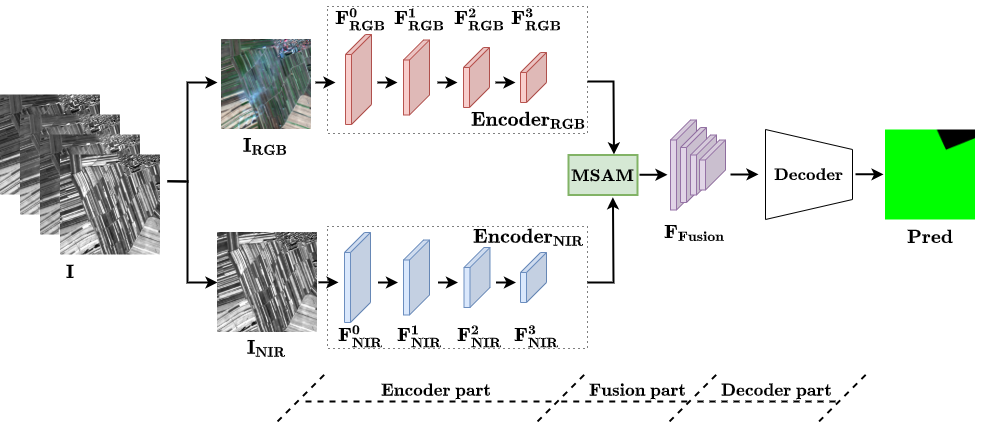
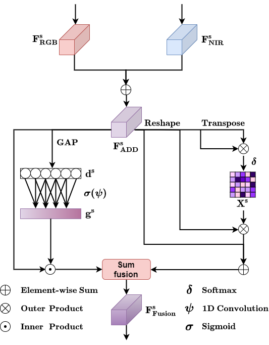

  
# A General Dual-Branch Framework for Land Use and Land Cover Mapping Models with Multi-Spectral Data
  

## Abstract

Land use and land cover (LULC) mapping based on multi-spectral images can in principle be considered an application of semantic segmentation, but LULC mapping inputs include near-infrared (NIR) data in addition to RGB data. It has been experimentally found that LULC mapping performance based on RGB data alone is better than that based on RGB and NIR data when using some established single-branch encoder-decoder models. To address this issue, we propose a dual-branch encoder-decoder (DBED) framework that can be applied to existing encoder-decoder models for semantic segmentation. First, the multi-spectral input data is divided into two parts: RGB and NIR, and fed to the respective branch for encoding. The dual-branch structure facilitates cross-modal complementary information encoding without deteriorating the original RGB modality-specific feature extraction. Second, an attention module named multi-spectral attention module (MSAM) is proposed to mine the contextual correlation between the multi-spectral feature maps, leading to further performance boosting. We apply this framework to three mainstream semantic segmentation models and validate it on the Gaofen Image Dataset. Experimental results show that this structure brings performance improvements.

## Illustration of DBED ##

    

The overview of the dual-branch encoder-decoder (DBED) framework. Given a multi-spectral image $I$, the encoder of RGB and the encoder of NIR extract the features of RGB and NIR data respectively. The RGB and NIR features of the same stage are fused by a multi-spectral attention module and then fed to the decoder.

## Illustration of MSAM ##

    

The schema of the multi-scale attention module (MSAM). Given the encoded features of stage s. MSAM generates the fusion feature , and feed it to the decoder.

## Get Started ##

The whole project is based on [MMSegmentation](https://github.com/open-mmlab/mmsegmentation) with version v0.29.0.  
**Step 0.** Please refer to [get_started.md]((https://github.com/open-mmlab/mmsegmentation/blob/master/docs/en/get_started.md#installation) for installation. 
**Step 1.** Paste all the files in this repo to mmsegmentation folders, overwrite the existing file. 
**Step 2.** Prepare the dataset, please download the Gaofen Image Dataset ([GID](https://x-ytong.github.io/project/GID.html)), and cropped the images. We cropped the image into .npy format. You need to fix the dataroot, img_dir, ann_dir and several settings in the config. 
**Step 3.** Train a model with command, you can follow the readme.md in MMSegmentation 
